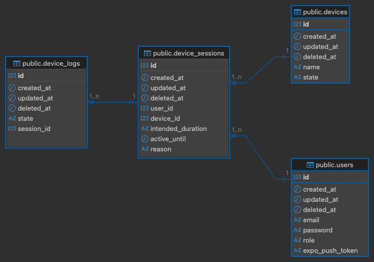

# MQTT Motor Backend - Device Management Complete

A Go backend server for MQTT motor control with incremental development. This project is built step-by-step, with each phase adding new features while maintaining clean, well-documented code.

## 🎯 Current Phase: Device Session Management ✅

> **Note:** Device session management is now complete! The backend now tracks device activation sessions, linking ON/OFF events and durations for full auditability.

### What We've Built

#### ✅ **Foundation (Phase 1)**
- **Configuration Management**: Environment variables with sensible defaults
- **Database Connection**: PostgreSQL with GORM ORM
- **HTTP Server**: Gin framework with health endpoint
- **Project Structure**: Clean, modular architecture

#### ✅ **User Authentication (Phase 2)**
- **User Model**: Database schema with password hashing
- **Registration**: `POST api/v1/register` endpoint with validation
- **Login**: `POST api/v1/login` endpoint with JWT token generation
- **Authentication Middleware**: JWT token validation for protected routes
- **Environment Configuration**: `.env` file support with comprehensive settings

#### ✅ **Device Management (Phase 3)**
- **Device Models**: Database schema for devices and activation logs
- **Device Activation**: `POST /api/v1/activate` endpoint with queue system
- **Asynchronous Processing**: Background goroutine for device control
- **Quota Management**: Daily usage limits with thread-safe implementation
- **Device State Management**: ON/OFF state tracking with database persistence

#### ✅ **MQTT Integration**
- **MQTT Broker Connection**: Robust connection to MQTT broker for device control

#### ✅ **Device Session Management (Phase 4)**
- **Session Tracking**: Each device activation creates a session, linking ON/OFF events and durations
- **Session Logs**: All state changes and durations are linked to session IDs for full traceability
- **Auditability**: Enables detailed reporting and analysis of device usage

---

## 🗄️ Database Schema (ERD)

### Entity Relationship Diagram



- **users**: Stores user accounts.
- **devices**: Stores device info and state.
- **sessions**: Tracks each device activation session (start/end, user, device).
- **device_logs**: Logs all device state changes (ON/OFF, duration, session link).

---

### Project Structure
```
pumplink-backend/
├── main.go              # 🚀 Application entry point with routes
├── go.mod               # 📦 Go module dependencies
├── .env                 # ⚙️  Environment variables (configurable)
├── .env.example         # 📋 Example environment variables
├── .gitignore           # 🚫 Git ignore rules
├── config/
│   └── config.go        # ⚙️  Configuration management
├── database/
│   └── database.go      # 🗄️  Database connection and setup
├── models/
│   ├── user.go          # 👤 User model with password hashing
│   ├── device.go        # 🔧 Device model for motor control
│   ├── deviceActivation.go # 📊 Device activation logging
│   └── deviceLog.go     # 📝 Device state change logging
├── handlers/
│   ├── user.go          # 🔐 User registration and login handlers
│   └── DeviceHandler.go # ⚡ Device activation with queue system
└── middleware/
    └── auth.go          # 🛡️  JWT authentication middleware
```

## 🚀 Installation & Setup

### Prerequisites
- **Go** (1.18 or newer) - Download from [golang.org](https://golang.org/dl/)
- **PostgreSQL** database

### Step-by-Step Setup

#### 1. Clone and Navigate
```bash
git clone https://github.com/musabgulfam/pumplink-backend.git
cd pumplink-backend
```

#### 2. Install Dependencies
```bash
# Download and install all required Go packages
go mod tidy
```

#### 3. Configure Environment (Optional)
```bash
# Copy the example .env file and modify as needed
cp .env.example .env

# Edit the .env file with your specific values
nano .env
```

#### 4. Run the Server
```bash
# Start the development server
go run main.go
```

You should see output like:
```
2025/08/04 11:57:58 Starting MQTT Motor Backend on port 8080
2025/08/04 11:57:58 Database connected successfully
2025/08/04 11:57:58 Running in debug mode
[GIN-debug] Listening and serving HTTP on :8080
```

## 🔐 API Endpoints

### Public Endpoints (No Authentication Required)

#### Health Check
```bash
GET /health
```
Response:
```json
{
  "status": "ok",
  "message": "MQTT Motor Backend is running"
}
```

#### User Registration
```bash
POST /register
Content-Type: application/json

{
  "email": "user@example.com",
  "password": "securepassword123"
}
```
Response:
```json
{
  "message": "User registered successfully",
  "user": {
    "id": 1,
    "email": "user@example.com",
    "created_at": "2025-08-04T11:57:58.418603+05:00",
    "updated_at": "2025-08-04T11:57:58.418603+05:00"
  }
}
```

#### User Login
```bash
POST /login
Content-Type: application/json

{
  "email": "user@example.com",
  "password": "securepassword123"
}
```
Response:
```json
{
  "message": "Login successful",
  "token": "eyJhbGciOiJIUzI1NiIsInR5cCI6IkpXVCJ9...",
  "user": {
    "id": 1,
    "email": "user@example.com",
    "created_at": "2025-08-04T11:57:58.418603+05:00",
    "updated_at": "2025-08-04T11:57:58.418603+05:00"
  }
}
```

### Protected Endpoints (Authentication Required)

#### User Profile
```bash
GET /api/profile
Authorization: Bearer <JWT_TOKEN>
```
Response:
```json
{
  "message": "Protected endpoint accessed successfully",
  "user": {
    "id": 1,
    "email": "user@example.com",
    "created_at": "2025-08-04T11:57:58.418603+05:00",
    "updated_at": "2025-08-04T11:57:58.418603+05:00"
  }
}
```

#### Device Activation
```bash
POST /api/activate-device
Authorization: Bearer <JWT_TOKEN>
Content-Type: application/json

{
  "device_id": 1,
  "duration": 30
}
```
Response:
```json
{
  "status": "Request added to queue"
}
```

**Notes:**
- `device_id`: Integer ID of the device to activate
- `duration`: Integer representing minutes (will be converted to `duration * time.Minute`)
- **Asynchronous**: Request is queued and processed in background
- **Quota Check**: Subject to daily usage limits (1 hour by default)
- **Queue Protection**: Returns 429 if queue is full (max 100 pending requests)
- **Database Only**: Currently updates database state (MQTT integration coming in Phase 4)

### Device Status

```bash
GET /api/device/:id/status
Authorization: Bearer <JWT_TOKEN>
```
Response:
```json
"ON"
```

---

## 🛡️ Role-Based Access Control (RBAC)

- **How it works:**  
  Protected endpoints (like `/api/activate`) now require the user to have an appropriate role.
- **Roles:**  
  - `pending`: Default for new users, cannot activate devices.
  - `user`: Can activate devices and access device features.
  - `admin`: Full access, including management endpoints.
- **How to use:**  
  Admins can promote users by updating their role in the database.

---

## ⚙️ Configuration

Our application uses environment variables for configuration. All variables are optional and have sensible defaults.

### Environment Variables

| Variable      | Default                  | Description                        | Example                        |
|---------------|--------------------------|------------------------------------|--------------------------------|
| `DB_HOST`     | `localhost`              | PostgreSQL host                    | `db.example.com`               |
| `DB_USER`     | `postgres`               | PostgreSQL user                    | `myuser`                       |
| `DB_PASSWORD` | `password`               | PostgreSQL password                | `mypassword`                   |
| `DB_NAME`     | `mqtt_motor`             | PostgreSQL database name           | `mqtt_motor`                   |
| `DB_PORT`     | `5432`                   | PostgreSQL port                    | `5432`                         |
| `MQTT_BROKER` | `tcp://localhost:1883`   | MQTT broker URL                    | `tcp://broker.example.com:1883`|
| `JWT_SECRET`  | `supersecret`            | Secret for JWT token signing       | `my-super-secret-key-123`      |
| `PORT`        | `8080`                   | HTTP server port                   | `3000`                         |
| `DEBUG_MODE`  | `true`                   | Enable debug logging               | `false`                        |
| `DAILY_QUOTA` | `1h`                     | Daily motor usage limit            | `2h30m`                        |
| `MAX_RETRIES` | `3`                      | Maximum retry attempts             | `5`                            |

### Setting Environment Variables

#### Using .env File (Recommended)
```bash
# Edit the .env file
nano .env

# Set your values
DB_PATH=./myapp.db
PORT=3000
JWT_SECRET=my-secret-key
DEBUG_MODE=false
```

#### Using System Environment Variables
```bash
export DB_HOST="localhost"
export DB_USER="postgres"
export DB_PASSWORD="mypassword"
export DB_NAME="mqtt_motor"
export DB_PORT="5432"
export PORT="3000"
export JWT_SECRET="my-secret-key"
export DEBUG_MODE="false"
```

## 🏗️ Architecture Overview

### Current Architecture
```
┌─────────────────┐
│   Client App    │  ← HTTP requests (REST API)
│  (Web/Mobile)   │
└─────────────────┘
         │
         ▼
┌─────────────────┐
│  Gin HTTP       │  ← Web server with routing
│    Server       │
└─────────────────┘
         │
         ▼
┌─────────────────┐
│   Middleware    │  ← JWT authentication
│   (Auth)        │
└─────────────────┘
         │
         ▼
┌─────────────────┐
│   Handlers      │  ← Business logic
│   (User/Device) │
└─────────────────┘
         │
         ▼
┌─────────────────┐    ┌─────────────────┐
│ PostgreSQL      │    │  Background     │  ← Asynchronous
│   Database      │    │   Processor     │    device control
└─────────────────┘    └─────────────────┘
         │                       │
         ▼                       ▼
┌─────────────────┐    ┌─────────────────┐
│   Device        │    │   MQTT Broker   │  ← Real-time
│   State         │    │   (Phase 4)     │    communication
└─────────────────┘    └─────────────────┘
```

### How It Works

1. **Client Request**: A client sends an HTTP request with JWT token
2. **Gin Router**: Routes the request to appropriate handler
3. **Middleware**: JWT authentication for protected routes
4. **Handler Processing**: Business logic (device activation, etc.)
5. **Queue System**: Device requests are queued for background processing
6. **Background Processing**: Asynchronous device control with quota management
7. **Database Operations**: Device state and activation logging
8. **Response**: Immediate JSON response with queue status

### Key Technologies

- **Gin**: High-performance HTTP web framework for Go
- **GORM**: Object-Relational Mapping for database operations
- **PostgreSQL**: Powerful, open-source object-relational database system
- **JWT**: JSON Web Tokens for authentication
- **bcrypt**: Secure password hashing
- **godotenv**: Environment variable management
- **Goroutines**: Concurrent background processing
- **Channels**: Thread-safe communication between components

## 🔄 Next Phases

### Phase 4: MQTT Integration (Coming Next)
- **MQTT Client**: Connection to MQTT broker for device communication
- **Real-time Control**: Direct MQTT commands to ESP32 devices
- **Device Communication**: Publish/subscribe for device state updates
- **Live State Updates**: Real-time device state synchronization

### Phase 5: Advanced Features
- **Device Discovery**: Automatic device registration
- **Real-time Monitoring**: Live device state updates
- **Advanced Quota**: Per-user and per-device quotas
- **Device Scheduling**: Time-based device activation

## 📝 Commit Message Guidelines

Use [Conventional Commits](https://www.conventionalcommits.org/) for clear and consistent commit messages:

| Type      | When to use it                                      | Example                                 |
|-----------|-----------------------------------------------------|-----------------------------------------|
| `feat:`   | New feature                                         | `feat: add device scheduling endpoint`  |
| `fix:`    | Bug fix                                             | `fix: correct quota calculation`        |
| `refactor:` | Code change that neither fixes a bug nor adds a feature | `refactor: simplify device handler logic` |
| `chore:`  | Maintenance, build, or tooling changes              | `chore: update dependencies`            |
| `docs:`   | Documentation only changes                          | `docs: update README for PostgreSQL`    |
| `test:`   | Adding or updating tests                            | `test: add tests for auth middleware`   |
| `style:`  | Formatting, missing semi colons, etc; no code change| `style: format code with gofmt`         |
| `perf:`   | Performance improvements                            | `perf: optimize device lookup`          |

**Examples:**
- `feat: implement JWT authentication`
- `fix: handle device activation edge case`
- `docs: add ERD image to README`
- `refactor: move DB logic to separate package`
- `chore: remove SQLite references`

## 🧪 Development & Testing

```bash
# Run all tests
go test ./...

# Format all Go code
go fmt ./...

# Lint code
go vet ./...
```

## 🤝 Contributing

When adding new features:
1. Follow the incremental phase approach
2. Add comprehensive comments explaining what and why
3. Use appropriate commit messages (see above)
4. Update this README with new features
5. Test thoroughly before moving to next phase
6. Ensure thread-safety for concurrent operations

## 📄 License

MIT License - feel free to use this code for
